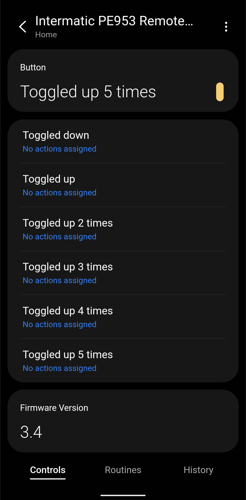
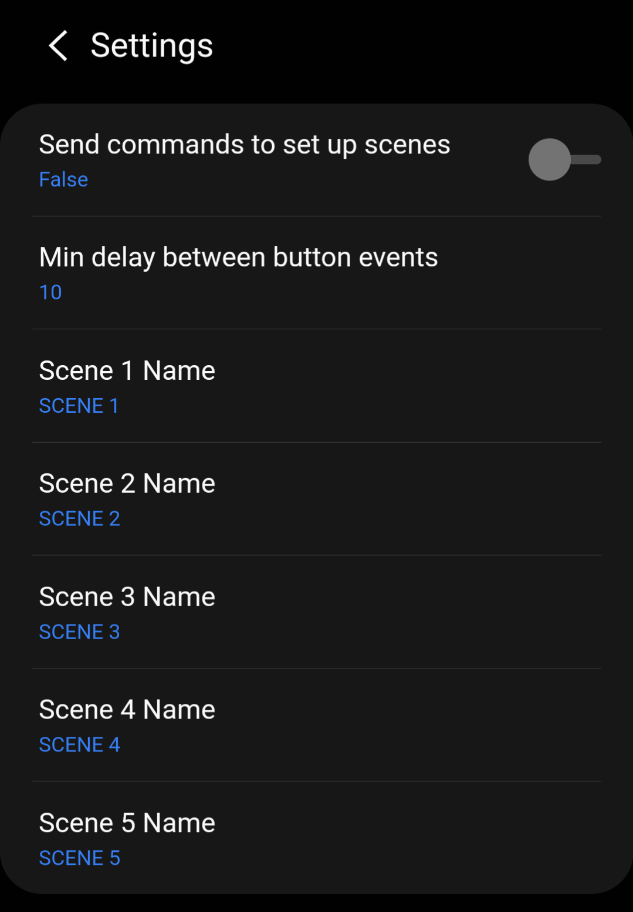

# SmartThings Edge Driver for Intermatic PE953 Remote Control

[Product Website](https://www.intermatic.com/Product/PE953)

[Driver Folder](intermatic-pe953)

## Overview

This driver allows the five PE953 scenes to be used as button presses that can trigger automations. Firmware version of the remote will also be displayed.

*This driver improves the interaction between the PE953 Remote Control and the SmartThings hub, but is not required for the PE953 to function independently or with the PE653 Pool Controller.*

*This driver has been tested on firmware version 3.4.*

Scenes are mapped to the button events in the table below. Note that there is no way to differentiate OFF commands between the five scenes.

|PE953 Scene|PE953 Scene Action|SmartThings Button Event|
|---|---|---|
|SCENE 1|ON|Toggled up|
|SCENE 2|ON|Toggled up 2 times|
|SCENE 3|ON|Toggled up 3 times|
|SCENE 4|ON|Toggled up 4 times|
|SCENE 5|ON|Toggled up 5 times|
|SCENE 1|OFF|Toggled down|
|SCENE 2|OFF|Toggled down|
|SCENE 3|OFF|Toggled down|
|SCENE 4|OFF|Toggled down|
|SCENE 5|OFF|Toggled down|

## Screenshots

 

## Installation

1. Install the driver using the channel invitation.
2. Follow the PE653 installation instructions, which include instructions for adding the PE953 to your SmartThings z-wave network.
3. Navigate to the device in the SmartThings app.
4. Press the ENTER key on the PE953 remote control to wake it up. Keep the PE953 awake while performing the following steps in the app:
   - Swipe down on the screen to trigger the Refresh command. This will retrieve the firmware version from the PE953.
   - In the device settings menu, toggle the "Send commands to set up scenes" option On and then Off. This will add the hub the PE953 scenes.
   - Rename any scenes. The new scene names should populate on the PE953 scene menu.
5. Test activating each scene from the PE953:
   - If the PE953 fails to proceed to the "Up/Down" screen for any scene, it indicates that no action has been defined for that scene. Repeat the "Send commands to set up scenes" step above.
   - If any scene fails to generate the proper button event, first try repeating the "Send commands to set up scenes" step above. If this does not result in the correct behavior, additional troubleshooting will likely require viewing device logs through the CLI.

## Device Settings

**Send commands to set up scenes:** When turned ON, the driver will send a series of z-wave commands to the PE953 to attempt to include the hub node in each scene. This option should be left in the OFF state after scenes have successfully been linked to button events. *The PE953 must be awake when this setting is toggled on.*

**Minimum delay between button events:** When a scene is activated, the PE953 transmits the command multiple times. This setting allows repetitive scene reports within the specified time frame (in seconds) to be ignored. The delay will not apply if a different scene is received within the specified time frame.

**Scene Names:** Scene names will be transmitted to the PE953 and reflected on the scene screen. There is a 10 character maximum, and the characters allowed are A-Z, 0-9, and space. *The PE953 must be awake when a new name is saved.*

## Live Logging (CLI)

To view live logging for Edge drivers, you must use the SmartThings Command Line Interface (CLI).

1. Download the most recent release from https://github.com/SmartThingsCommunity/smartthings-cli/releases.
2. Open a Command Prompt window and navigate to the directory where the CLI was downloaded.
3. The first time you use the CLI, you will be prompted to log into your SmartThings account. Run a list of your devices by typing:
```
smartthings devices
```
4. After authenticating the CLI, find the Driver ID for this driver by running:
```
smartthings edge:drivers:installed
```
5. Now start live logging by running the command below, entering the Driver ID found above and the IP address of your ST Hub in place of \<DriverID> and \<HubIP>:
```
smartthings edge:drivers:logcat <DriverID> --hub-address <HubIP>
```
